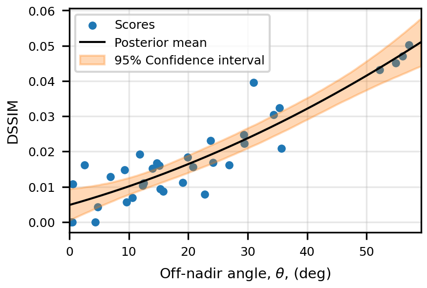

# Hyperspectral Image Quality



# Getting Started

## Step 1
Assuming that you have setup an SSH key, clone this repository to your workspace:
```
git clone git@github.com:TomvanEemeren/hsi_quality.git
```
Navigate to the newly created directory:
```
cd hsi_quality
```

## Step 2
Setup the conda environment:
```
conda env create -f environment.yml
```
Activate the conda environment:
```
conda activate hsi312
```

## Step 3
Run the `preprocess_data.py` file to download and preprocess the hyperspectral image dataset:
```
python preprocess_data.py --location dubai --full --directory cleaned 
```
Note that you must be connected to the local internet network at the NTNU to access the server and download the data!

## Step 4
Run the `analyze_data.py` file to create the visualizations and plots:
```
python analyze_data.py --location dubai --directory cleaned --zone 40n
```
where zone corresponds to the UTM zone of the specified location.

# Example
The results folder already contains some prepared datasets A model can be fitted to these datasets by running the example file:
```
python fit_model.py --order 2 --metric SSIMLambda 
```
This will create a plot of the fitted model along with some plots of the prior and posterior distributions and puts them in the `models` directory.